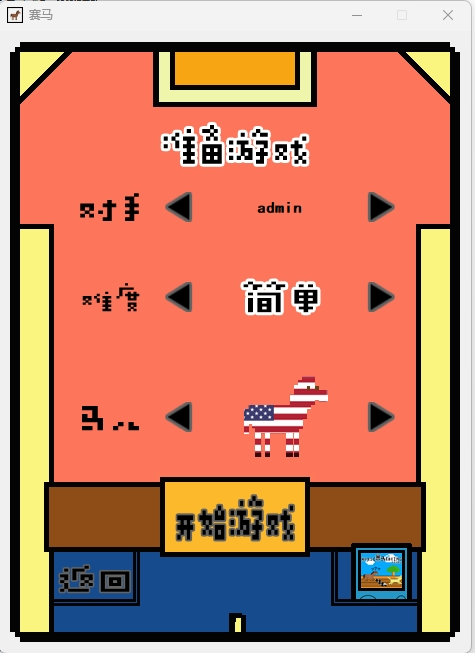
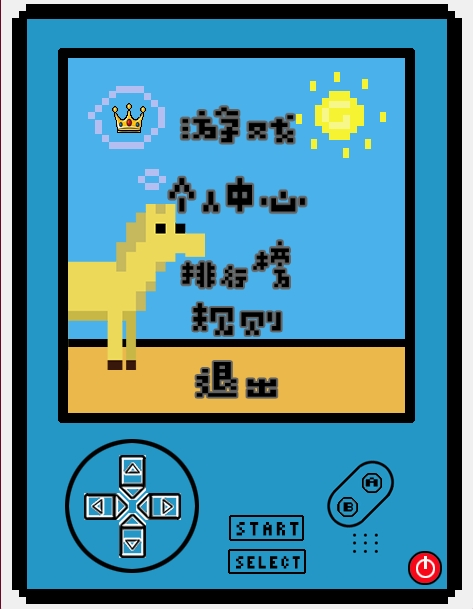
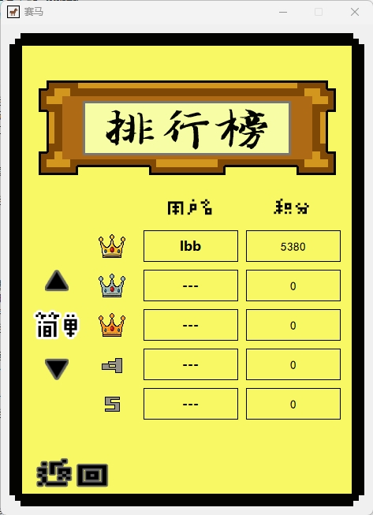
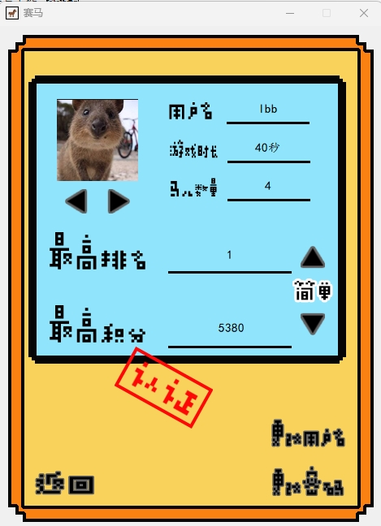
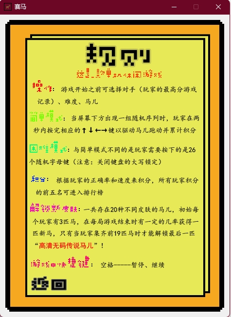
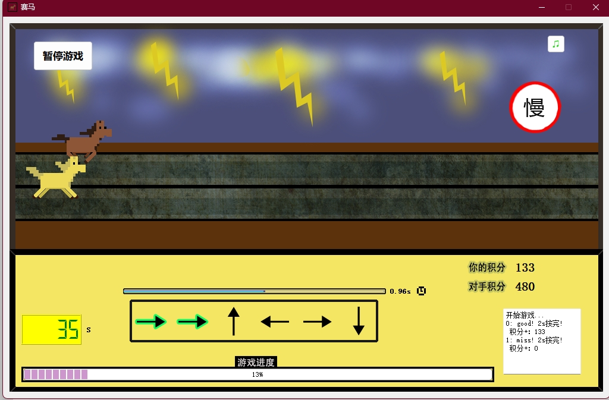
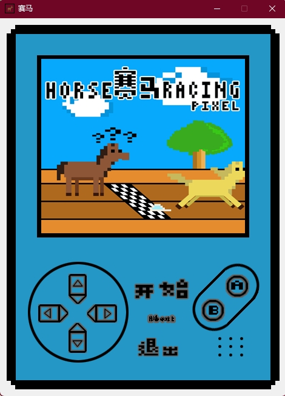

# HR / HorseRacing

一个基于 **Qt Widgets** 开发的单机魔幻赛马小游戏。这个仓库保留了作者大学时期的课程/练手作品，整体风格很有早期桌面端游戏项目的味道：本地账号体系、赛马玩法、排行榜、抽奖/成长元素，以及打包为 Windows 安装程序的思路都已经具备。

## 项目简介

游戏主程序位于 `HorseRacing/` 目录，使用 `qmake` 工程文件 `HorseRacing.pro` 进行构建，界面主要由 Qt Designer 的 `.ui` 文件组成。项目是典型的 Qt Widgets 桌面应用，适合拿来回顾早期 Qt C++ 项目结构，也适合作为老项目现代化 CI/CD 的练习样本。

从现有代码和界面资源来看，项目主要包含这些能力：

- 登录、注册与基础账号管理
- 主菜单与游戏入口
- 简单 / 困难模式赛马玩法
- 排行榜与成绩刷新
- 抽奖、成长/经验相关机制
- 管理界面与若干弹窗
- Inno Setup 打包脚本（用于生成 Windows 安装包）

## 目录结构

```text
.
├── HorseRacing/
│   ├── HorseRacing.pro      # Qt qmake 工程文件
│   ├── main.cpp             # 程序入口
│   ├── *.cpp / *.h / *.ui   # 主要界面与业务逻辑
│   ├── ICON.ico             # 程序图标
│   └── HRsetup.iss          # Inno Setup 安装脚本
└── README.md
```

## 技术栈

- C++
- Qt Widgets / Qt Multimedia
- qmake
- Inno Setup
- GitHub Actions（已补充，用于自动构建 Windows 版本并上传到 Release）


## 游戏截图

下面这些截图来自项目实际运行界面，基本能反映这款大学时期 Qt 桌面小游戏的整体完成度和风格。

### 启动与登录

| 启动界面 | 登录界面 |
| --- | --- |
|  |  |

### 注册与主菜单

| 注册界面 | 主菜单 |
| --- | --- |
|  |  |

### 游戏过程与排行榜

| 赛马过程 | 排行榜 |
| --- | --- |
|  |  |

### 其他界面

| 关于对话框 |
| --- |
|  |

## 本地开发

### 1. 打开工程

使用 Qt Creator 打开：

```text
HorseRacing/HorseRacing.pro
```

### 2. 构建要求

建议环境：

- Windows
- Qt 5（包含 Widgets 与 Multimedia 模块）
- MinGW 或 MSVC（当前 CI 采用 MinGW）
- Inno Setup 6（用于制作安装包）

### 3. 运行说明

这是一个偏 Windows 桌面端的历史项目，代码中包含：

- `QSound` 多媒体依赖
- 资源/插件目录路径处理
- Windows 安装包脚本

因此最稳妥的开发与运行环境仍然是 Windows + Qt。理论上可以继续做跨平台改造，但当前仓库更适合先保证 Windows 产物的可构建与可分发。

## Release 自动构建

仓库已补充 GitHub Actions 工作流：

- 当推送标签（如 `v1.6.0`）时：
  - 自动在 Windows runner 上安装 Qt
  - 使用 `qmake` + `mingw32-make` 构建可执行文件
  - 使用 `windeployqt` 收集运行时依赖
  - 使用 Inno Setup 生成安装包
  - 将安装包与便携压缩包自动上传到对应 GitHub Release 附件

如果你想手动触发，也可以在 Actions 页面使用 `workflow_dispatch`。

## 已知现状

这是一个较早期的个人项目，所以保留了一些时代特征：

- 工程文件与代码风格比较传统
- 仓库里存在若干 Qt Creator 用户态文件（如 `.pro.user`）
- 原始 Inno Setup 脚本中包含本地绝对路径，需要在 CI 中动态生成更通用的脚本
- 旧项目未自带现代化 CI，需要额外补齐自动发布流程

这些都不影响把它作为“老项目整理 + 自动发布改造”的对象。

## 后续可继续优化的方向

- 增加项目截图与玩法说明
- 补一份更详细的游戏规则文档
- 清理不应入库的 IDE 用户文件
- 拆分数据读写逻辑，提升可维护性
- 为核心逻辑增加基础测试
- 增加多版本 Qt / 编译器兼容性验证

---

这个仓库对我来说，更像是一个大学时期作品的时间切片。现在补上 README 和自动构建发布流程，相当于帮当年的自己把项目重新整理了一遍。
